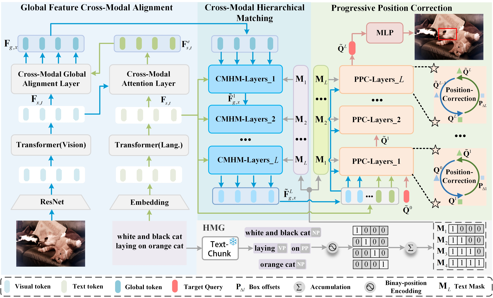
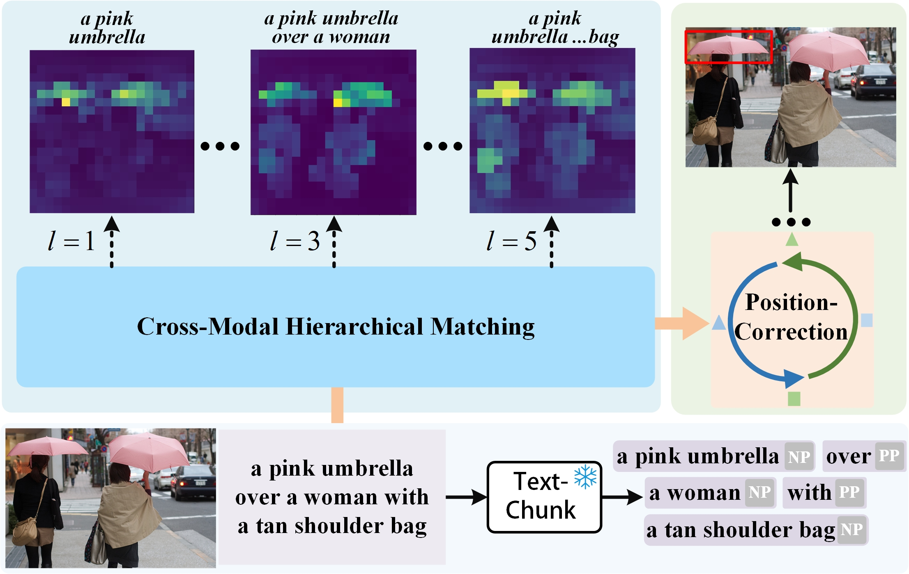

# VGNet
========
This is the official implementation of [Phrase Decoupling Cross-Modal Hierarchical Matching and Progressive Position
Correction for Visual Grounding].

<p align="center">
  
</p>


## Introduction
Visual grounding has attracted wide attention thanks to its broad application in various visual language tasks. Although visual grounding has made significant research progress, existing methods ignore the promotion effect of the association between text and image features at different hierarchies on cross-modal matching. This paper proposes a Phrase Decoupling Cross-Modal Hierarchical Matching and Progressive Position Correction Visual Grounding method. It first generates a mask through decoupled sentence phrases, and a text and image hierarchical matching mechanism is constructed, highlighting the role of association between different hierarchies in cross-modal matching. In addition, a corresponding target object position progressive correction strategy is defined based on the hierarchical matching mechanism to achieve accurate positioning for the target object described in the text. This method can continuously optimize and adjust the bounding box position of the target object as the certainty of the text description of the target object improves. This design explores the association between features at different hierarchies and highlights the role of features related to the target object and its position in target positioning. 

<p align="center">
  
</p>


## Visualization
Visualization of attention maps at different hierarchies and the model detection results.

<p align="center">
  
</p>


## Installation
1. Clone the repository.
    ```bash
    git clone https://github.com/X7J92/VGNet
    ```

2. Install PyTorch 1.5+ and torchvision 0.6+.
    ```bash
    conda install -c pytorch pytorch torchvision
    ```

3. Install the other dependencies.
    ```bash
    pip install -r requirements.txt
    ```


## Preparation
Please refer to [get_started.md](docs/get_started.md) for the preparation of the datasets and pretrained checkpoints.


## Training

The following is an example of model training on the referit dataset.
```
python -m torch.distributed.launch --nproc_per_node=4 --use_env train.py --config configs/VGNet_R101_referit.py
```
We train the model on 4 GPUs(4090) with a total batch size of 64 for 90 epochs. 
The model and training hyper-parameters are defined in the configuration file ``VLTVG_R101_referit.py``. 
We prepare the configuration files for different datasets in the ``configs/`` folder. 


## Evaluation
Run the following script to evaluate the trained model with a single GPU.
```
python test.py --config configs/VLTVG_R101_referit.py --checkpoint VGNet_R101_referit.pth --batch_size_test 16 --test_split val
```
Or evaluate the trained model with 4 GPUs:
```
python -m torch.distributed.launch --nproc_per_node=4 --use_env test.py --config configs/VGNet_R101_referit.py --checkpoint VLTVG_R101_referit.pth --batch_size_test 16 --test_split val
```


## Acknowledgement
Part of our code is based on the previous works [DETR](https://github.com/facebookresearch/detr) and [TransVg](https://github.com/djiajunustc/TransVG).
